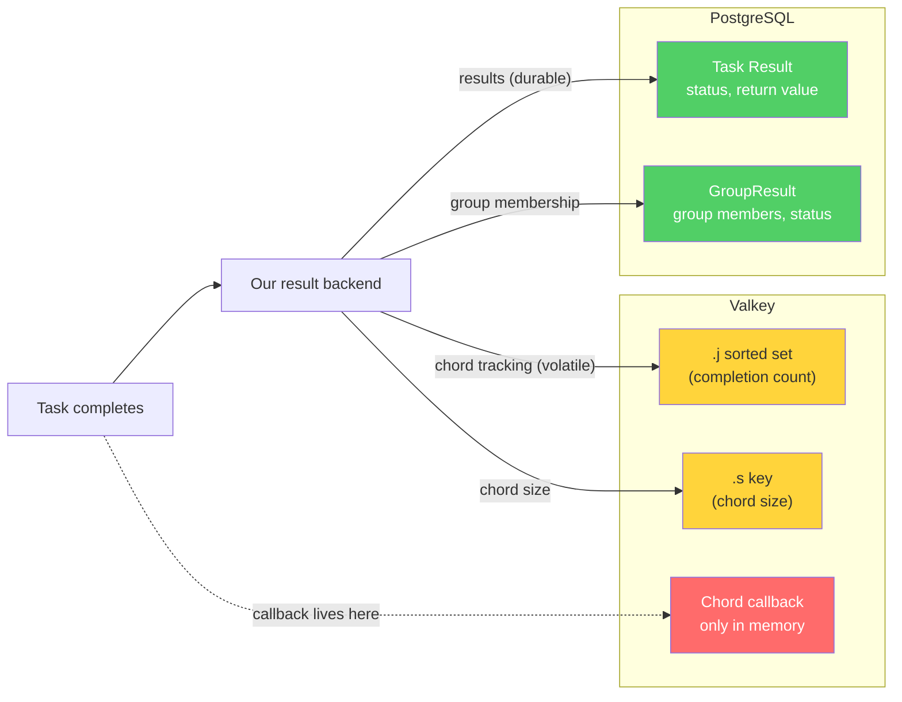
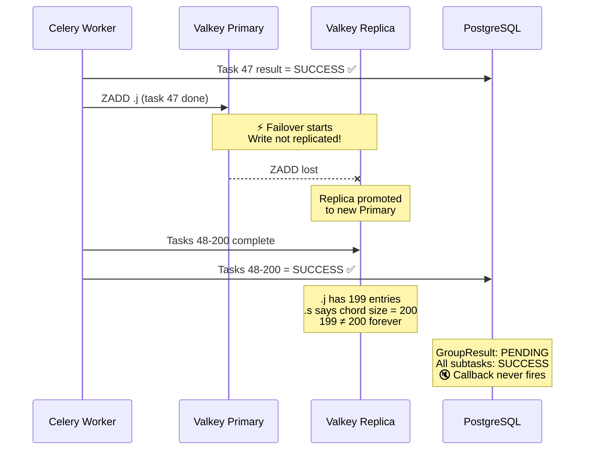
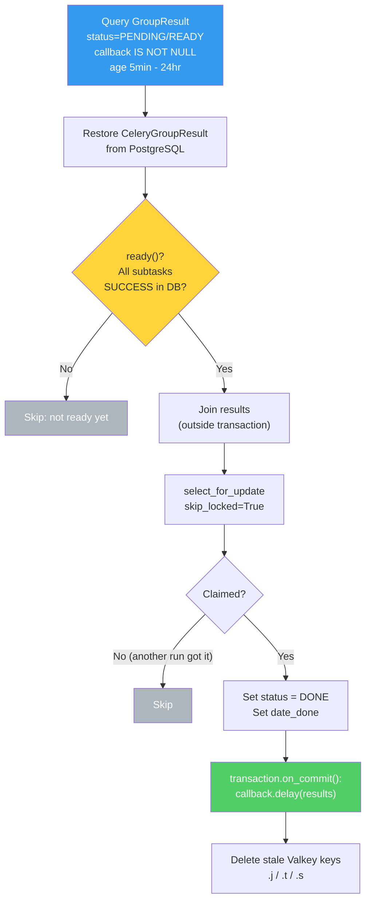

**TL;DR** — We wanted to patch our Celery broker Valkey cluster without downtime. AWS confirmed that replication during failover is best-effort, meaning chord tracking keys could be lost. So we built recovery tooling that persists chord callbacks in PostgreSQL and re-dispatches them if Valkey loses state during patching. Along the way we found a pickling bug in one of our task payloads and a return-type lie in Celery itself.

Up until recently, patching our Valkey clusters meant scheduling downtime. Drain the workers, apply the patch, bring everything back up. Safe, boring, and disruptive — every patching window meant a maintenance page for users and coordination across teams.

We wanted to stop doing that. AWS ElastiCache supports live patching: it rotates nodes one at a time, promotes replicas, and your clients reconnect automatically. For our cache clusters, this is a no-brainer. For our Celery broker cluster — the one that orchestrates every payout calculation and background job in the system — it's scarier. If live patching can lose even a few seconds of writes, it can silently break Celery chords. A broken chord means a callback that never fires, a payout that never completes, a customer waiting for results that will never arrive.

I'd never tried live patching on the broker before. It's also not something I would normally build alone — Celery internals are our platform team's domain. But AI changed the math on that.

## The setup

We run four Valkey clusters in each environment:

- Two are caches. If they lose data during a failover, we get cache misses and a brief latency spike. Annoying but not dangerous.
- One is a volatile key-value store. Similar deal — the data is transient by design.
- The fourth is our Celery broker. This is the one that keeps us up at night.

The broker drives all of our async processing. Every payout calculation, every export, every background job flows through it as Celery tasks. When AWS applies a patch to this cluster, it rotates nodes one at a time: take a replica offline, patch it, bring it back, promote it to primary, repeat. The whole thing takes minutes and clients mostly don't notice.

Mostly.

## How our Celery setup looked

We have a somewhat unusual Celery setup. Our result backend is a custom dual-backend: task results go to PostgreSQL, chord tracking keys live in Valkey. Individual task results need to survive restarts and be queryable, so they belong in a real database. Chord tracking (the `.j`, `.t`, `.s` sorted sets and counters Celery uses to know when all tasks in a group have finished) needs to be fast and atomic, which is what Valkey is there for.



On top of this, we have a task recovery system that scans PostgreSQL for orphaned task results and retries them — worker crashes, OOM kills, the usual. It works well for individual tasks. But chords? It doesn't know about chords. It can recover the individual subtasks, but the callback — the thing that says "all 200 payout tasks finished, now update the aggregate and send the email" — lives exclusively in Valkey's memory.

A chord in our system typically looks like this: one task fires off ~200 subtasks (one per employee/plan/date), wraps them in a chord group, and attaches a callback. The callback carries a nested dict mapping plan IDs to dates to employee IDs so the post-processing knows what to aggregate. When everything works, Celery's `on_chord_part_return` counts completed subtasks in the `.j` sorted set, and when the count hits the chord size, it fires the callback.

When it doesn't work, nothing fires. No error. No retry. Nothing.

## "Wait, is this even a real risk?"

Before building anything, we needed to understand whether live patching could actually lose data. My manager challenged the whole premise, and he had a good point. For planned upgrades, Valkey has a well-documented process: the replica gets patched first and synced with the primary, then the primary gets a write block and disconnects clients, the replica gets promoted, done. The `CLIENT_PAUSE` mechanism is right there in the [Valkey admin docs](https://valkey.io/topics/admin/). In theory, no writes should be lost during a planned patching event.

I tested `CLIENT_PAUSE` against our dev environment. The app handled it fine — workers reconnected, tasks resumed, all good. Our platform team also pointed out `redis_retry_on_timeout` as a Celery setting that helps with brief disconnections. So maybe this was a non-issue and we could just patch live without any preparation?

Then I asked AWS support directly. Their AI assistant wasn't very helpful, so I opened a case and got an actual ElastiCache engineer. The answer, confirmed in April 2026:

> Replication during failover is **best-effort**. There is a small time window where writes accepted by the old primary may **not** be replicated to the newly elected primary.

So planned upgrades are *better* than crash failovers — the manager was right about that. But AWS was also telling us that even planned upgrades don't guarantee zero write loss. Best-effort. Not "guaranteed". Time to build a safety net before attempting live patching.

> Fun fact: while investigating all this, we discovered our patching deadline was just AWS's recommended "apply by" date. The actual expiration was a year out. We'd been sprinting for a deadline that didn't exist. But at least now we had the time to do it right.

## What could go wrong

For caches, best-effort replication is fine. For the Celery broker, those lost writes can include chord tracking keys.



Say task 47 of 200 completes and Celery writes to the `.j` sorted set, but the primary fails over before that write replicates. Tasks 48 through 200 finish fine on the new primary. Now the `.j` set has 199 entries, the chord size counter says 200, and `on_chord_part_return` will never see the count match. The callback never fires. The `GroupResult` in PostgreSQL shows `PENDING` with all subtasks in `SUCCESS`. Everything looks fine from the database's perspective, but the Valkey-side state is permanently broken. The chord is stuck forever.

Our testing showed roughly 10–30 small chords could get stuck per failover event. For payout processing chords, that would mean customers waiting for results that would never arrive. Not acceptable.

## Making the callback recoverable

The fix starts with persisting the callback in PostgreSQL alongside the `GroupResult`. That's one focused PR. Once the callback lives in the database, we can build recovery tooling that reconstructs what Valkey lost.

The `recover_stuck_chords` management command starts by querying `GroupResult` for `PENDING`/`READY` records that have a stored callback, aged between 5 minutes and 24 hours. The minimum age avoids false positives from chords that are still legitimately in progress.



For each candidate, the command restores the Celery `GroupResult` from the database and calls `.ready()`. Here's the key insight: `.ready()` reads each subtask's status from PostgreSQL, not Valkey. So even if the Valkey tracking state is gone, we can still tell whether all subtasks completed. If they have, the command joins the results (outside the DB transaction, to avoid holding row locks during I/O) and claims the chord atomically via `select_for_update(skip_locked=True)`. That prevents two concurrent recovery runs from dispatching the same callback. The actual dispatch happens via `transaction.on_commit()` for at-most-once delivery. Finally, it cleans up stale Valkey chord keys (`.j`, `.t`, `.s`) to prevent phantom re-triggers.

### The bug that unit tests missed

I couldn't get comfortable with mock-based tests for something this critical. So I pushed Claude hard to write integration tests that exercise the real result backend against real PostgreSQL with real serialization. No mocks on the data path.

The integration tests immediately caught a bug in Celery itself.

`CeleryGroupResult.restore()` does not return a `CeleryGroupResult` instance. It returns a raw list. The docstring and the method name both suggest you get a `GroupResult` back. You don't — you get `backend.restore_group(id)`, which is `meta['result']`: a list of `AsyncResult` objects. Calling `.ready()` on a list gives you an `AttributeError` at runtime. The 21 unit tests, with their mocked Celery layer, never caught this because the mocks returned whatever we told them to.

The fix:

```python
restored_results = CeleryGroupResult.restore(
    id=gr.group_id, backend=backend
)
# restore() returns a list, not a GroupResult. Wrap it.
celery_group = CeleryGroupResult(
    id=gr.group_id,
    results=restored_results,
    app=celery_app,
)
if not celery_group.ready():
    continue
```

Nine integration tests later, we had confidence in every step of the pipeline: pickle round-trips, `ready()` reading from PostgreSQL, `join()` collecting results, callback surviving encode/decode, full end-to-end recovery, and the edge cases (single-task chord, 20-task chord, incomplete chords being skipped).

## Safe defaults

First live patching attempt on dev after deploying everything, and we found the command's interface was painful. We fixed it so that it fits naturally into management-command automations: added a `--repair` flag, and made the default a dry run. Small change, but it makes the command safe to run as a diagnostic without any risk.

## The patching runbook

All of this feeds into a runbook we follow for Valkey patching windows:

**Before patching.** Run `recover_stuck_chords` to clean up any pre-existing stuck chords (there shouldn't be any). Confirm Datadog monitors are active and not firing.

**During patching.** Nothing to do. Monitor Celery worker logs for connection errors and reconnection events. The patching process handles node rotation automatically.

**After patching.** Wait 5 minutes (chords younger than that might still be legitimately in progress), then run the command to see what's stuck, then `--repair` to recover. Verify another run shows zero stuck chords.

This was our first time doing live patching on the broker cluster. The whole point was to get here: patching without a maintenance window, without draining workers, without disrupting users. The recovery tooling is our safety net for the worst case.

And it wasn't just a hypothetical — after the first live patching run in US production, we actually had one broken chord. The tool recovered it.

## The duct tape

The recovery command can't help if the callback was never stored. Chords created before the callback-storage PR was deployed, or chords where the callback serialization fails for some reason we haven't seen yet, still need manual investigation.

We don't have automatic recovery yet. Someone has to run the command. We could hook it into the patching automation eventually, but we want to run it manually for a while and build confidence first. The 5-minute wait-then-run cadence fits naturally into the patching window anyway.

And as our platform team put it during one of our early conversations: we seriously need to get off Celery for chord-based workflows long-term. Chords are a coordination primitive that was never designed for durability. We're bolting recovery onto something that fundamentally stores its coordination state in a volatile cache. It works (the tests prove it), but it's duct tape on a design that assumes your broker never loses data. Step Functions or Airflow would give us durable orchestration without the duct tape. That's a bigger conversation for another day.

## What AI did and didn't do

I want to be honest about the role AI played here, because it's a useful data point.

Claude was genuinely good at the parts I'm not an expert in. It explained how the result backend works, generated the initial implementation, wrote dozens of tests that covered edge cases I probably wouldn't have thought of, and caught the `restore()` return-type lie through a deep-dive investigation. The "ultrathink" prompt that produced the integration test suite was probably the single highest-value interaction in this whole project.

But Claude didn't know our system. It didn't know that some callbacks used unpickleable lambda functions. It didn't know that our task recovery system doesn't cover chords. It didn't know a lot of things. I had to feed it that context, and a lot of the investigation was me reading code and docs and figuring out the right questions to ask. The AI moved fast on implementation; the slow part was still me understanding the problem and making sure we didn't miss anything.

And the code review was essential. Our platform team caught real issues — JSON-vs-pickle edge cases, race conditions, a few others. AI got me to a reviewable PR fast. The human reviewer made it production-ready.

A year ago, this project wouldn't have happened the way it did. I'd have filed a ticket, the platform team would have prioritized it against their roadmap, and we'd have patched with downtime in the meantime. That's not a failure of process — that's how specialization works. You don't normally send SRE to write Celery backend code.

But AI is changing where those boundaries sit. Not erasing them. The platform engineer's review caught things I wouldn't have found on my own, and that review mattered *more*, not less, because the code was AI-assisted. The boundary moved from "who can write this code" to "who can review this code," and that's a meaningful shift. Problems that used to wait in a queue can now get solved by whoever is closest to the pain, as long as the right expert is in the review loop.

For reliability specifically, that matters a lot. The gap between "we know this is a risk" and "we have tooling to handle it" is where incidents live. Anything that shrinks that gap — better abstractions, better tooling, or an AI that can teach you enough Celery internals to write a recovery command — makes the system safer.

We'll still need to get off Celery chords long-term. The duct tape is good duct tape, but it's still duct tape. In the short term, though, we went from "patching requires downtime" to "patching requires running one command afterward." That's a win.

---

*This post is a reworked version of an internal post-mortem I originally wrote for my team. Some identifying details have been abstracted; the technical content is unchanged.*
