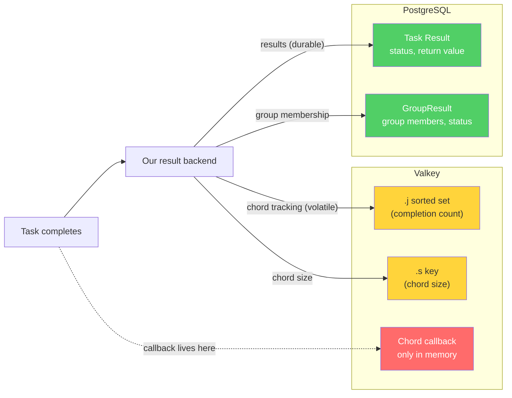
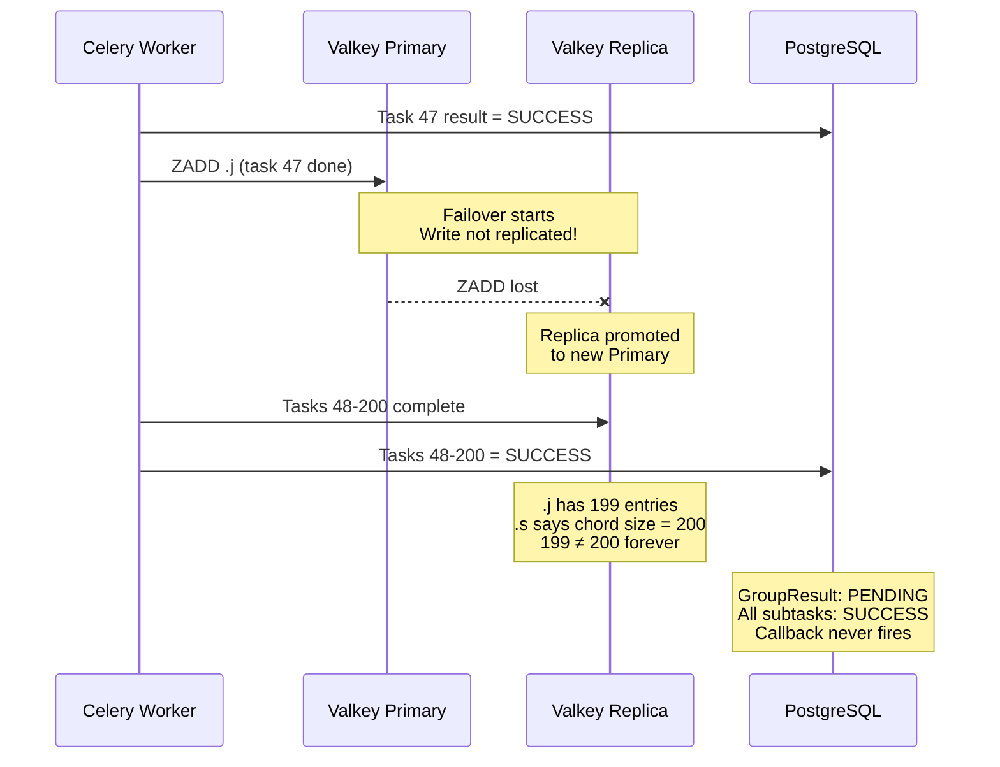
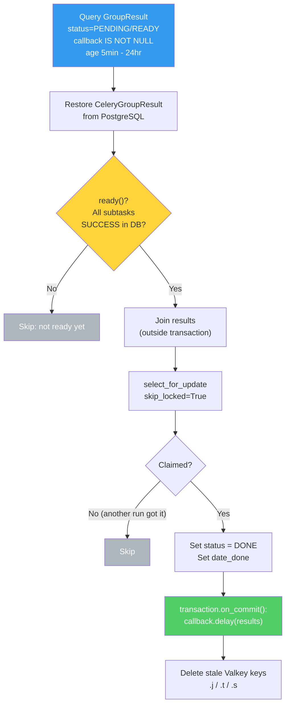

**TL;DR** — We wanted to patch our Celery broker Valkey cluster without downtime. We talked to AWS and they confirmed that replication during failover is best-effort, meaning - in our case - chord tracking keys could be lost. We decided to build recovery tooling that persists chord callbacks in PostgreSQL and re-dispatches them if Valkey loses state during patching. We saw and fixed a few bugs along the way (like fixing an unexpected return-type in Celery's chord result handling or figuring out why some callbacks cannot be pickled).
Until recently, patching our Valkey clusters meant scheduling downtime, drainining the workers, applying the patch, bringing everything back up. It always had to be off-hours and at different times for different regions we handle. It was safe, but boring and disruptive — every patching window meant a maintenance page for users and coordination across teams.
We wanted to stop doing that. As we knew already, AWS ElastiCache supports live patching: it rotates nodes one at a time, promotes replicas, and your clients should reconnect automatically. For our cache clusters, a brief interruption wasn't a big deal. For our Celery broker cluster that orchestrates every payout calculation and background job in the system — it's more complicated. If due to live patching we lose even a few seconds of writes, it can silently break Celery chords. Broken chord means that some callbacks will never fire, some payouts never complete and some customers will be waiting for results that never show up.
I'd never tried live patching on the broker before. It's also not something I would normally prepare for and build alone — Celery internals are our platform team's domain. However with some AI assistance and supportive people, I was able to pull that off!

## Setup
We run four Valkey clusters in each environment:

- Two are caches. If they lose data during a failover, we get cache misses and a brief latency spike - it might be annoying but not dangerous.
- One is a volatile key-value store. Similar — the data is transient by design.
- The fourth is our Celery broker and this one was the culprit.

Celery broker drives all of our async jobs and processing. Every payout calculation, every data export, each background job goes through it as a Celery task. When AWS applies a patch to this cluster, it rotates nodes one at a time: take a replica offline, patch it, bring it back, promote it to primary, repeat. The whole thing should take minutes and clients should not notice any disruption.

And this is where things got complicated.

## How our Celery setup looked

We have a quite unusual Celery setup. Our result backend is a custom, inhouse built dual-backend: task results go to PostgreSQL, while chord tracking — the `.j`/`.t`/`.s` sorted sets and counters plus the serialized callback — lives in Valkey. Individual task results need to survive restarts and be queryable, so they are stored in a durable database. Chord tracking needs to be fast and atomic, which is what Valkey is used for.



On top of this, we have a task recovery system that scans PostgreSQL for orphaned task results and retries them — worker crashes, Out-Of-Memory kills, the usual stuff that just happens. It works well for individual tasks but for chords? It doesn't know about chords - it can only recover the individual subtasks. Chords and their callbacks — those that say "all 200 payout tasks finished, now update the aggregate and send the email" — live exclusively in Valkey's memory.

A chord in our system typically looks like this: one task fires off a group of ~200 subtasks (for example one per employee/plan/date), wraps them in a chord group, and attaches a callback. The callback contains a nested dict which maps plan IDs to dates to employee IDs so the follow up jobs know what to aggregate. When everything works, Celery's `on_chord_part_return` counts completed subtasks in the `.j` sorted set, and when the count hits the chord size, it fires the callback.

When it doesn't work, callback never fires. No error, no retry - just waiting for the last job that already finished but was missed.

## "Wait, is this even a real risk?"

Before building anything, we needed to understand whether live patching could actually lose data. My manager challenged the whole thing, and he had a good point. For planned upgrades, Valkey has a well-documented process: the replica is patched first and synced with the primary. Then the primary blocks writes, disconnects clients, and the replica is promoted. Done. The `CLIENT_PAUSE` mechanism is right there in the [Valkey admin docs](https://valkey.io/topics/admin/). In theory, no writes should be lost during a planned patching event.

I tested `CLIENT_PAUSE` against our dev environment. The app handled it fine — workers reconnected, tasks resumed, all good. Our platform team also pointed out `redis_retry_on_timeout` as a Celery setting that helps with brief disconnections. So maybe my manager was right and this is a non-issue and we can just patch live?

I needed confirmation, so I asked AWS support directly. Their AI assistant wasn't very helpful, so I opened a case and got an actual ElastiCache engineer. The answer, confirmed in April 2026:

> Replication during failover is **best-effort**. We do not use `CLIENT_PAUSE`. There is a small time window where writes accepted by the old primary may **not** be replicated to the newly elected primary.

So planned upgrades are *better* than crash failovers — my manager was right about that. Unfortunately AWS told us that even planned upgrades don't guarantee zero write loss. They are best-effort, not "guaranteed". I decided to build a safety net.

> Fun fact: while investigating all this, we discovered our patching deadline was just AWS's recommended "apply by" date. The mandatory apply-by date was a year out. We'd been rushing for a deadline that didn't exist. But at least now we had the time to do it right.

## What could go wrong

As mentioned above - for caches, best-effort replication is fine. For the Celery broker, those lost writes can include our custom chord tracking keys.



Let's say task 47 of 200 completes and Celery writes to the `.j` sorted set, but the primary fails over before that write replicates. Tasks 48 through 200 finish fine on the new primary. Now the `.j` set has 199 entries while `.s` still says 200, so `on_chord_part_return` function never sees the counts match. The callback never gets fired. The `GroupResult` in PostgreSQL shows `PENDING` even though all subtasks are in `SUCCESS` status. Everything looks fine from the database's perspective, but the Valkey-side tracking is inconsistent, and the chord will never complete.

Our testing showed roughly 10–30 small chords could get stuck per failover event. For payout processing chords, that means customers waiting for results that never arrive and it was not an acceptable risk for us.

## Making the callback recoverable

Our preparation started with a change to persist the callback in PostgreSQL alongside the `GroupResult` which we already stored. That's one PR. Once the callback lives in the database, we can build recovery tooling that reconstructs what Valkey lost.

Next we implemented on-demand management command. The `recover_stuck_chords` command starts by querying `GroupResult` for `PENDING`/`READY` records that have a stored callback, aged between 5 minutes and 24 hours. The minimum age avoids false positives from chords that are still legitimately in progress. The 24-hour upper bound keeps us from re-dispatching callbacks for chords that were already manually cleaned up or are out of scope for this tool.



For each identified `GroupResult`, the command restores it from the database and calls `.ready()`. This method reads each subtask's status from PostgreSQL, not Valkey. So even if the Valkey tracking state is gone, we can still tell whether all subtasks completed. If they have, the command joins the results and claims the chord atomically via `select_for_update(skip_locked=True)`. That prevents two concurrent recovery runs from dispatching the same callback. The actual dispatch happens via `transaction.on_commit()`, so we only enqueue once the claim is durably committed. Finally, the command cleans up stale Valkey chord keys (`.j`, `.t`, `.s`) to prevent phantom re-triggers.

### Bug that our unit tests missed

Mock-based unit tests didn't give me enough confidence for something as critical as chords. I decided to push Claude hard to write integration tests that exercise the real result backend against real PostgreSQL with real serialization. No mocks on the data path.

The integration tests immediately caught a surprise in how Celery's chord result API behaves with our backend.

In our setup, `CeleryGroupResult.restore()` doesn't return a `CeleryGroupResult` instance — it returns a raw list. The docstring and the method name both suggest you get a `GroupResult` back. You don't — you get `backend.restore_group(id)`, which is `meta['result']`: a list of `AsyncResult` objects. Calling `.ready()` on a list gives you an `AttributeError` at runtime. Our unit tests, with a mocked Celery layer, never caught this — the mocks returned exactly what we told them to.

Fix was simple:

```python
restored_results = CeleryGroupResult.restore(
    id=gr.group_id, backend=backend
)
# restore() returns a list, not a GroupResult. Wrap it.
celery_group = CeleryGroupResult(
    id=gr.group_id,
    results=restored_results,
    app=celery_app,
)
if not celery_group.ready():
    continue
```

Once we had whole integration suite tested, we had confidence in the pipeline: pickle round-trips, `ready()` reading from PostgreSQL, `join()` collecting results, callback surviving encode/decode, full end-to-end recovery, and the edge cases (single-task chord, 20-task chord, incomplete chords being skipped).

## The patching runbook

We've gathered all of this experience and fed it into a runbook we had in place for Valkey patching:

**Before patching.** Run `recover_stuck_chords` to clean up any pre-existing stuck chords (there shouldn't be any). Confirm monitors are active and not firing.

**During patching.** Nothing to do. Monitor Celery worker logs for connection errors and reconnection events. The patching process handles node rotation automatically.

**After patching.** Wait 5 minutes (chords younger than that might still be legitimately in progress), then run the dry run command to see what's stuck, then full run to recover lost chords. One last run to verify there are no more stuck chords.

This was our first time doing live patching on the broker cluster. The whole point of this project was to reach exactly that state: patching without a maintenance window, without draining workers, without disrupting users. The recovery tooling is our safety net for the worst case.

It appeared that we were smart to implement all this — after the first live patching run in production, we did have one broken chord. The tool recovered it and we saved ourselves from calling the worst type of an incident - the data consistency one.

## The duct tape

Our platform team put it this way during one of our earlier conversations: we seriously need to get off Celery for chord-based workflows long-term. Chords are a coordination primitive that was never designed for durability. We're doing all that recovery prep for something that fundamentally stores its coordination state in a volatile cache. It works (the tests prove it), but it's duct tape on a design that assumes your broker never loses data. Step Functions or Airflow would give us durable orchestration without the workarounds. But that's an internal conversation for another day :)

## What AI did and didn't do

I don't want to hide or diminish the amount of work that AI did here, because I believe it's a useful perspective.

Claude was very good at the parts I'm not an expert in. It explained how the result backend works, generated the initial implementation, wrote dozens of tests that covered edge cases I probably wouldn't have thought of, and caught the `restore()` return-type surprise through a deep-dive investigation. The "ultrathink" prompt that produced the integration test suite was probably the single highest-value interaction in this whole mini-project.

However Claude didn't know our system as a whole. It missed that some callbacks used unpickleable lambda functions and we needed to identify the issue and fix it (otherwise callbacks that could not be pickled would not be stored in database). It didn't know that our task recovery system doesn't cover chords. I had to do initial context gathering, problem exploration and then feed it with proper context. A lot of the investigation was me going through the code, docs and figuring out the right questions to ask - also my engineering experience helped here. The AI significantly sped up the implementation but the slow engineering part was still me understanding the problem and making sure we didn't miss anything.

The human code review was essential. Our platform team caught real issues — JSON-vs-pickle edge cases, race conditions and a few others. AI got me to a reviewable PR fast but it was the human reviewer who helped make it production-ready.

A year ago, this project wouldn't have happened the way it did. I would have filed a ticket, the platform team would have prioritized it against their roadmap, and we'd have patched with downtime in the meantime because of the deadline. That's not a failure of process — that's how specialization works. You don't normally send SRE to write Celery backend code. AI shifted that: the boundary moved from "who can write this code" to "who can understand the problem and drive it to completion." The platform engineer's review caught things I wouldn't have found on my own, and it mattered *more*, not less, because the code was AI-assisted. For reliability work specifically, that shift matters — the gap between "we know this is a risk" and "we have tooling to handle it" is where incidents live, and anything that shrinks it makes the system safer.

We'll still need to get off Celery chords long-term. The duct tape is good duct tape for now, but it's still duct tape. In the short term, though, we went from "patching requires downtime" to "patching requires running one command afterward." That's a win.

---

*This post is a reworked version of an internal post-mortem I originally wrote for my team. Some identifying details have been abstracted; the technical content is unchanged.*

